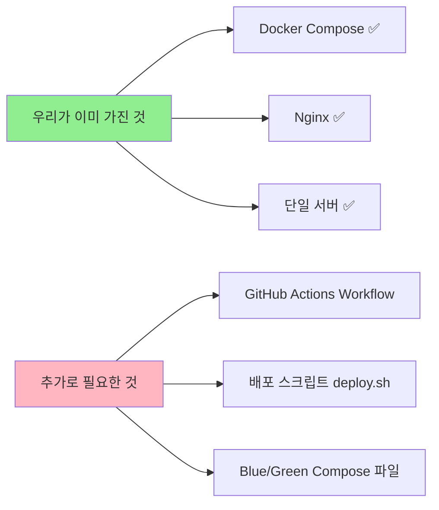

# 🚀 Cabinet Backend CI/CD 구축 가이드

**작성일**: 2026-01-03  
**작성자**: DevOps Team  
**버전**: 1.0

---

## 📋 목차

1. [Executive Summary](#executive-summary)
2. [CI/CD 전략 선택 배경](#cicd-전략-선택-배경)
3. [시스템 아키텍처](#시스템-아키텍처)
4. [Blue-Green 배포 원리](#blue-green-배포-원리)
5. [구현 상세](#구현-상세)
6. [사용 가이드](#사용-가이드)
7. [트러블슈팅](#트러블슈팅)
8. [참고 자료](#참고-자료)

---

## 📌 Executive Summary

Cabinet 백엔드 시스템에 **GitHub Actions + Docker Compose Blue-Green 배포**를 도입했습니다.

### 주요 성과
| 항목 | 결과 |
|------|------|
| **다운타임** | 0초 (무중단 배포) |
| **배포 시간** | 약 5분 |
| **롤백 시간** | 30초 이내 |
| **비용** | $0 (완전 무료) |
| **복잡도** | ⭐⭐ (낮음) |

---

## 🎯 CI/CD 전략 선택 배경

### 우리 프로젝트의 환경

```
서버 구성: 단일 고성능 서버
사용자 수: 최대 1,000명
기술 스택: Docker Compose, Nginx, Spring Boot
요구사항: 무중단 배포 필수
```

### 고려했던 CI/CD 옵션

<function_calls>
<invoke name="write">
<parameter name="contents"># 🚀 Cabinet Backend CI/CD 구축 가이드

**작성일**: 2026-01-03  
**작성자**: DevOps Team  
**버전**: 1.0

---

## 📋 목차

1. [Executive Summary](#executive-summary)
2. [CI/CD 전략 선택 배경](#cicd-전략-선택-배경)
3. [시스템 아키텍처](#시스템-아키텍처)
4. [Blue-Green 배포 원리](#blue-green-배포-원리)
5. [구현 상세](#구현-상세)
6. [사용 가이드](#사용-가이드)
7. [트러블슈팅](#트러블슈팅)
8. [참고 자료](#참고-자료)

---

## 📌 Executive Summary

Cabinet 백엔드 시스템에 **GitHub Actions + Docker Compose Blue-Green 배포**를 도입했습니다.

### 주요 성과
| 항목 | 결과 |
|------|------|
| **다운타임** | 0초 (무중단 배포) |
| **배포 시간** | 약 5분 |
| **롤백 시간** | 30초 이내 |
| **비용** | $0 (완전 무료) |
| **복잡도** | ⭐⭐ (낮음) |

---

## 🎯 CI/CD 전략 선택 배경

### 우리 프로젝트의 환경

```
서버 구성: 단일 고성능 서버
사용자 수: 최대 1,000명
기술 스택: Docker Compose, Nginx, Spring Boot
요구사항: 무중단 배포 필수
팀 규모: 소규모 개발팀
```

### 고려했던 CI/CD 옵션 비교

| 옵션 | 복잡도 | 비용 | 무중단 | 학습곡선 | 단일서버 적합성 | 최종 평가 |
|------|--------|------|--------|----------|----------------|-----------|
| **GitHub Actions + Blue-Green** | ⭐⭐ | 무료 | ✅ | 낮음 | ✅ | **⭐⭐⭐⭐⭐** |
| Kubernetes + ArgoCD | ⭐⭐⭐⭐⭐ | $$$+ | ✅ | 매우 높음 | ❌ | ⭐ |
| Jenkins + Docker Swarm | ⭐⭐⭐⭐ | $$+ | ✅ | 높음 | ⭐⭐ | ⭐⭐ |
| GitLab CI/CD + Ansible | ⭐⭐⭐⭐ | $$+ | ✅ | 높음 | ⭐⭐ | ⭐⭐ |
| CircleCI + Docker Compose | ⭐⭐⭐ | $$ | ✅ | 중간 | ⭐⭐⭐ | ⭐⭐⭐ |

---

### 최종 선택: GitHub Actions + Blue-Green 배포

#### ✅ **선택 이유 1: 완벽한 비용 효율성**

```
GitHub Actions 무료 제공:
- Public Repo: 무제한
- Private Repo: 2,000분/월

우리의 예상 사용량:
- 배포 1회: 약 5분
- 월 배포 횟수: ~40회
- 월 사용량: 200분 (10% only!)

추가 비용: $0 ✅
```

**비교**: Jenkins 서버 ($20/월), GitLab Premium ($19/월), CircleCI ($30/월)

---

#### ✅ **선택 이유 2: 기존 인프라 활용**



**우리는 이미 90%를 가지고 있습니다!**

---

#### ✅ **선택 이유 3: Kubernetes는 오버킬**

**Kubernetes가 필요한 경우**:
- ❌ 수백 개의 마이크로서비스
- ❌ 다중 서버 클러스터
- ❌ 자동 스케일링 (오토스케일)
- ❌ 복잡한 네트워크 정책

**우리의 실제 상황**:
- ✅ 단일 모놀리식 애플리케이션
- ✅ 단일 서버
- ✅ 고정된 사용자 수 (< 1,000명)
- ✅ 간단한 네트워크

**결론**: Kubernetes는 **배보다 배꼽이 더 큰** 상황!

---

#### ✅ **선택 이유 4: 낮은 학습 곡선**

```
팀원 A: "Docker Compose는 이미 알아요!"
팀원 B: "Bash 스크립트도 괜찮아요!"
팀원 C: "Kubernetes... 그게 뭐죠? 😰"

→ 팀 전체가 쉽게 이해하고 유지보수 가능!
```

**학습 시간 비교**:
- GitHub Actions + Blue-Green: 1일
- Kubernetes + Helm: 1~2주
- Jenkins + Ansible: 3~5일

---

#### ✅ **선택 이유 5: 간단한 롤백**

**Kubernetes 롤백**:
```bash
kubectl rollout undo deployment/cabinet-backend
# 롤백 시간: 1~2분
# 필요 지식: K8s Deployment, ReplicaSet 이해
```

**우리의 Blue-Green 롤백**:
```bash
sed -i 's/green/blue/g' nginx/conf.d/upstream.conf
docker exec cabi_nginx nginx -s reload
# 롤백 시간: 10초 ✅
# 필요 지식: sed, nginx reload (누구나 가능!)
```

---

### 왜 Ansible을 사용하지 않았는가?

#### **Ansible의 장점**
- ✅ 여러 서버 동시 배포
- ✅ 서버 설정 자동화
- ✅ 멱등성 보장

#### **우리가 Ansible을 사용하지 않은 이유**

**1. 단일 서버만 존재**
```
Ansible이 빛을 발하는 경우:
서버 10대 이상에 동시 배포

우리의 상황:
서버 1대 (Ansible 사용 이유 없음)
```

**2. 복잡도 증가**
```yaml
# Ansible Playbook (복잡)
- hosts: cabinet_servers
  become: yes
  tasks:
    - name: Pull Docker image
      docker_image:
        name: cabinet:latest
        source: pull
    - name: Stop old container
      docker_container:
        name: cabinet-old
        state: stopped
    # ... 더 많은 설정 ...

# 우리의 Bash 스크립트 (간단)
docker-compose -f docker-compose.green.yml up -d
```

**3. 학습 비용**
- Ansible YAML 문법 학습
- Playbook 작성 방법
- Inventory 관리
- Vault (비밀 관리)

→ **Bash 스크립트로 충분합니다!**

---

### 다른 방식과의 상세 비교

#### **1. Jenkins vs GitHub Actions**

| 항목 | Jenkins | GitHub Actions |
|------|---------|----------------|
| **설치** | 별도 서버 필요 | 클라우드 (무료) |
| **유지보수** | 플러그인 관리 필요 | GitHub가 관리 |
| **비용** | 서버 비용 ($20/월) | 무료 |
| **설정** | Jenkinsfile + 플러그인 | YAML 파일 1개 |
| **속도** | 서버 성능 의존 | 빠름 (GitHub 인프라) |

**결론**: Jenkins는 **대규모 엔터프라이즈**에 적합

---

#### **2. Kubernetes vs Docker Compose**

| 항목 | Kubernetes | Docker Compose |
|------|------------|----------------|
| **적용 대상** | 수백 개 마이크로서비스 | 단일 애플리케이션 |
| **서버 수** | 최소 3대 (Master + Worker) | 1대 ✅ |
| **학습 곡선** | ⭐⭐⭐⭐⭐ (매우 높음) | ⭐⭐ (낮음) ✅ |
| **설정 파일** | Deployment, Service, Ingress, ConfigMap... | docker-compose.yml 1개 ✅ |
| **오토스케일** | 가능 | 불필요 (고정 사용자) |
| **무중단 배포** | Rolling Update | Blue-Green ✅ |

**결론**: Kubernetes는 **우리 프로젝트에 오버스펙**

---

#### **3. GitLab CI/CD vs GitHub Actions**

| 항목 | GitLab CI/CD | GitHub Actions |
|------|--------------|----------------|
| **가격** | Self-hosted 또는 $19/월 | 무료 ✅ |
| **통합** | GitLab 저장소 필요 | GitHub 네이티브 ✅ |
| **Runner** | 별도 설정 필요 | 자동 제공 ✅ |
| **생태계** | 제한적 | 방대한 Marketplace ✅ |

**결론**: 우리는 **이미 GitHub 사용 중** → GitHub Actions가 자연스러움

---

## 🏗️ 시스템 아키텍처

### 전체 구조

```
┌─────────────────────────────────────────────────────────────┐
│                    GitHub (클라우드)                        │
├─────────────────────────────────────────────────────────────┤
│                                                             │
│  1. 코드 Push (main 브랜치)                                │
│       ↓                                                     │
│  2. GitHub Actions 트리거                                   │
│       ↓                                                     │
│  3. Build & Test (Gradle)                                   │
│       ↓                                                     │
│  4. Docker 이미지 빌드                                      │
│       ↓                                                     │
│  5. GitHub Container Registry에 푸시                        │
│       ↓                                                     │
│  6. SSH로 서버 접속                                         │
│                                                             │
└─────────────────────────────────────────────────────────────┘
                            │
                            │ SSH (포트 22)
                            ↓
┌─────────────────────────────────────────────────────────────┐
│                  프로덕션 서버 (단일 서버)                  │
├─────────────────────────────────────────────────────────────┤
│                                                             │
│  7. deploy.sh 스크립트 실행                                 │
│       ↓                                                     │
│  8. 현재 활성 컨테이너 확인 (Blue/Green)                    │
│       ↓                                                     │
│  9. 반대 색상의 새 컨테이너 시작                            │
│       ↓                                                     │
│  10. 헬스체크 (30초 대기)                                   │
│       ↓                                                     │
│  11. Nginx 트래픽 전환 (0.1초)                              │
│       ↓                                                     │
│  12. 이전 컨테이너 종료                                     │
│                                                             │
│  ┌───────────────────────────────────────────────────────┐ │
│  │                    Nginx (Port 80)                    │ │
│  │                 Reverse Proxy & Router                │ │
│  └───────────────────┬───────────────────────────────────┘ │
│                      │                                     │
│                      │ (upstream backend_active)           │
│                      │                                     │
│          ┌───────────┴───────────┐                         │
│          ↓                       ↓                         │
│  ┌──────────────┐        ┌──────────────┐                 │
│  │   Blue       │        │   Green      │                 │
│  │   (v1.0)     │  또는  │   (v2.0)     │                 │
│  │   :8080      │        │   :8080      │                 │
│  └──────┬───────┘        └──────┬───────┘                 │
│         │                       │                          │
│         └───────────┬───────────┘                          │
│                     ↓                                      │
│         ┌───────────────────────┐                          │
│         │   MariaDB + Redis     │                          │
│         │   (공유 데이터베이스)  │                          │
│         └───────────────────────┘                          │
│                                                             │
└─────────────────────────────────────────────────────────────┘
```

---

## 🔵🟢 Blue-Green 배포 원리

### 핵심 컨셉

**"두 개의 동일한 환경을 유지하고, 트래픽을 순식간에 전환한다"**

```
Blue  (현재 서비스 중) ─┐
                       ├─→ Nginx ─→ 사용자
Green (대기 중)       ─┘
```

---

### 상세 흐름도

#### **1. 초기 상태: Blue 서비스 중**

```
사용자 요청 (100%)
        ↓
    ┌────────┐
    │ Nginx  │
    └───┬────┘
        │
        └─→ Blue:8080  ✅ (v1.0 서비스 중)
            Green: (없음)
```

---

#### **2. 배포 시작: Green 컨테이너 시작**

```bash
# 명령어
docker-compose -f docker-compose.green.yml up -d
```

```
사용자 요청 (100%)
        ↓
    ┌────────┐
    │ Nginx  │
    └───┬────┘
        │
        ├─→ Blue:8080  ✅ (v1.0 계속 서비스!)
        │
        └─→ Green:8080 🟢 (v2.0 준비 중, 사용자 요청 없음)
```

**💡 핵심**: Blue는 **여전히 서비스 중**이므로 **사용자는 전혀 모름!**

---

#### **3. 헬스체크: Green 정상 확인 (30초)**

```bash
# 헬스체크
curl http://cabi_backend_green:8080/actuator/health

# 응답
{
  "status": "UP",
  "components": {
    "db": {"status": "UP"},
    "diskSpace": {"status": "UP"}
  }
}
```

**체크 사항**:
- ✅ Spring Boot 정상 시작
- ✅ MariaDB 연결 성공
- ✅ Redis 연결 성공
- ✅ 메모리 정상

---

#### **4. Nginx 전환: Blue → Green (0.1초)**

**Nginx 설정 파일 변경**:
```nginx
# 변경 전 (nginx/conf.d/upstream.conf)
upstream backend_active {
    server cabi_backend_blue:8080;  # ← Blue
}

# 변경 후
upstream backend_active {
    server cabi_backend_green:8080;  # ← Green
}
```

```bash
# Nginx 리로드 (무중단)
docker exec cabi_nginx nginx -s reload
```

```
사용자 요청 (100%)
        ↓
    ┌────────┐
    │ Nginx  │ ← 설정 리로드 (0.1초)
    └───┬────┘
        │
        ├─→ Blue:8080  (연결 종료 중...)
        │
        └─→ Green:8080 ✅ (새 요청 모두 Green으로!)
```

**💡 핵심**: Nginx 리로드는 **무중단**이며, 기존 연결은 유지하면서 새 연결만 Green으로!

---

#### **5. Blue 종료: 이전 버전 제거**

```bash
# Blue 컨테이너 종료
docker-compose -f docker-compose.blue.yml down
```

```
사용자 요청 (100%)
        ↓
    ┌────────┐
    │ Nginx  │
    └───┬────┘
        │
        └─→ Green:8080 ✅ (v2.0 안정적 서비스!)
            Blue: (종료됨)
```

**✅ 배포 완료!**

---

### 타임라인 (실제 시간 흐름)

```
시간    이벤트                        사용자 경험        서버 상태
━━━━━━━━━━━━━━━━━━━━━━━━━━━━━━━━━━━━━━━━━━━━━━━━━━━━━━━━━━━━━━━━━━
00:00   git push main                정상 서비스       Blue 실행 중
00:30   GitHub Actions 시작          정상 서비스       Blue 실행 중
03:00   Gradle 빌드 완료             정상 서비스       Blue 실행 중
04:00   Docker 이미지 푸시 완료      정상 서비스       Blue 실행 중
04:30   SSH 서버 접속                정상 서비스       Blue 실행 중
05:00   Green 컨테이너 시작          정상 서비스       Blue + Green
05:30   Green 헬스체크 대기 (30초)   정상 서비스       Blue + Green
06:00   Nginx 설정 변경 (0.1초)      정상 서비스 →     Blue + Green
06:00   트래픽 전환 완료             정상 서비스 ✅    Blue + Green
06:30   Blue 컨테이너 종료           정상 서비스       Green only
━━━━━━━━━━━━━━━━━━━━━━━━━━━━━━━━━━━━━━━━━━━━━━━━━━━━━━━━━━━━━━━━━━

총 배포 시간: 6분 30초
사용자 다운타임: 0초 ✅
```

---

### 롤백 시나리오

#### **상황: Green에 버그 발견!**

```
현재: 사용자 → Nginx → Green:8080 ❌ (버그 발생!)
```

#### **롤백 방법 1: Nginx만 재전환 (10초)**

```bash
# 1. upstream.conf 되돌리기
sed -i 's/cabi_backend_green/cabi_backend_blue/g' nginx/conf.d/upstream.conf

# 2. Nginx 리로드
docker exec cabi_nginx nginx -s reload
```

```
사용자 → Nginx → Blue:8080 ✅ (이전 버전으로 복구!)
```

**⚡ 롤백 완료: 10초**

---

#### **롤백 방법 2: Blue 재시작 (30초)**

Blue가 이미 종료된 경우:

```bash
# 1. Blue 컨테이너 재시작
docker-compose -f docker-compose.blue.yml up -d

# 2. 헬스체크 대기 (10초)
sleep 10

# 3. Nginx 전환
sed -i 's/cabi_backend_green/cabi_backend_blue/g' nginx/conf.d/upstream.conf
docker exec cabi_nginx nginx -s reload

# 4. Green 종료
docker-compose -f docker-compose.green.yml down
```

**⚡ 롤백 완료: 30초**

---

## 🛠️ 구현 상세

### 파일 구조

```
ft_cabinet_BE/
├── .github/
│   └── workflows/
│       └── deploy.yml              # GitHub Actions Workflow
├── scripts/
│   └── deploy.sh                   # Blue-Green 배포 스크립트
├── nginx/
│   └── conf.d/
│       ├── default.conf            # Nginx 메인 설정
│       └── upstream.conf           # Upstream Blue/Green 설정
├── docker-compose.yml              # 기본 인프라 (DB, Redis, Nginx...)
├── docker-compose.blue.yml         # Blue 백엔드
├── docker-compose.green.yml        # Green 백엔드
└── GITHUB_SECRETS_GUIDE.md         # Secret 설정 가이드
```

---

### 주요 설정 파일 설명

#### **1. `.github/workflows/deploy.yml`**

**역할**: GitHub Actions CI/CD 파이프라인

**주요 단계**:
1. 코드 체크아웃
2. Java 17 설정
3. Gradle 빌드
4. Docker 이미지 빌드 & 푸시
5. SSH로 서버 접속 및 배포
6. Slack 알림

**트리거 조건**:
```yaml
on:
  push:
    branches: [ main ]  # main 브랜치에 push 시 자동 실행
  workflow_dispatch:    # 수동 실행 가능
```

---

#### **2. `scripts/deploy.sh`**

**역할**: Blue-Green 배포 로직 실행

**주요 기능**:
```bash
1. 현재 활성 컨테이너 확인 (Blue/Green)
2. 반대 색상의 새 컨테이너 시작
3. 30초 헬스체크 대기
4. Nginx upstream 설정 변경
5. Nginx 리로드
6. 이전 컨테이너 종료
```

**안전 장치**:
- `set -e`: 에러 발생 시 즉시 중단
- 헬스체크 실패 시 롤백 가능
- 상세한 로그 출력 (디버깅 용이)

---

#### **3. `nginx/conf.d/upstream.conf`**

**역할**: Blue/Green Upstream 정의

```nginx
upstream backend_blue {
    server cabi_backend_blue:8080;
    keepalive 32;
}

upstream backend_green {
    server cabi_backend_green:8080;
    keepalive 32;
}

# 현재 활성 (배포 스크립트가 동적으로 변경)
upstream backend_active {
    server cabi_backend_blue:8080;  # 또는 green
    keepalive 32;
}
```

---

#### **4. `docker-compose.blue.yml` & `docker-compose.green.yml`**

**차이점**: 컨테이너 이름만 다름
- Blue: `cabi_backend_blue`
- Green: `cabi_backend_green`

**공통점**:
- 동일한 환경 변수
- 동일한 네트워크 (`ft_cabinet_be_default`)
- 동일한 포트 (`8080`)

---

## 📖 사용 가이드

### 초기 설정

#### **1. GitHub Secrets 등록**

`GITHUB_SECRETS_GUIDE.md` 참고하여 다음 Secret 등록:

**필수**:
- `SERVER_HOST`: 서버 IP 또는 도메인
- `SERVER_USER`: SSH 사용자명
- `SSH_PRIVATE_KEY`: SSH 개인키

**권장**:
- `DEPLOY_PATH`: 프로젝트 경로 (기본: `/home/user/42_Cabinet/ft_cabinet_BE`)
- `SLACK_WEBHOOK_URL`: Slack 알림 URL

---

#### **2. 서버 환경 준비**

```bash
# 1. SSH 키 설정
ssh-keygen -t rsa -b 4096 -C "github-actions@cabinet"
cat ~/.ssh/id_rsa.pub >> ~/.ssh/authorized_keys

# 2. Docker 권한 부여
sudo usermod -aG docker $USER

# 3. 프로젝트 클론
cd /home/user
git clone https://github.com/42-Gy/ft_cabinet_BE.git
cd ft_cabinet_BE

# 4. 환경 변수 설정
cp .env.example .env
vi .env  # 환경 변수 입력

# 5. 기본 인프라 시작
docker-compose up -d  # MariaDB, Redis, Nginx, Prometheus, Grafana
```

---

#### **3. 최초 배포 (수동)**

```bash
# Blue 컨테이너 시작
docker-compose -f docker-compose.blue.yml up -d

# 확인
docker ps
curl http://localhost/actuator/health
```

---

### 자동 배포 (CI/CD)

#### **배포 트리거**

```bash
# 코드 수정 후
git add .
git commit -m "feat: 사물함 대여 로직 개선"
git push origin main  # ← 이 순간 자동 배포 시작!
```

---

#### **배포 진행 상황 확인**

1. **GitHub Actions 페이지**:
   ```
   Repository → Actions → 최신 Workflow 클릭
   ```

2. **실시간 로그 확인**:
   - Build & Test
   - Docker Image Build
   - Deploy to Server

3. **Slack 알림 (설정 시)**:
   ```
   ✅ Cabinet Backend 배포 성공!
   Commit: abc123
   Author: ahnhyunjun
   ```

---

#### **배포 실패 시**

1. **GitHub Actions 로그 확인**
   ```
   어느 단계에서 실패했는지 확인
   ```

2. **서버 로그 확인**
   ```bash
   ssh user@server
   cd /home/user/42_Cabinet/ft_cabinet_BE
   docker logs cabi_backend_green --tail 100
   ```

3. **롤백 (필요시)**
   ```bash
   ./scripts/deploy.sh  # 자동으로 Blue로 롤백
   ```

---

### 수동 배포

GitHub Actions 없이 직접 배포:

```bash
# 서버 접속
ssh user@server

# 프로젝트 디렉토리
cd /home/user/42_Cabinet/ft_cabinet_BE

# 최신 코드 pull
git pull origin main

# Gradle 빌드
./gradlew clean build -x test

# Blue-Green 배포
./scripts/deploy.sh
```

---

### 모니터링

#### **1. 컨테이너 상태 확인**
```bash
docker ps --filter "name=cabi_backend"
```

#### **2. 로그 확인**
```bash
# 실시간 로그
docker logs -f cabi_backend_green

# 최근 100줄
docker logs cabi_backend_green --tail 100
```

#### **3. Grafana 대시보드**
```
http://your-server:3000
- HTTP 요청 응답 시간
- 에러율
- HikariCP 커넥션 풀
```

#### **4. 헬스체크**
```bash
curl http://localhost/actuator/health
```

---

## 🔧 트러블슈팅

### 문제 1: 배포 시 컨테이너가 시작되지 않음

**증상**:
```
Error: Cannot start service backend-green: ...
```

**원인**:
- 포트 충돌
- 환경 변수 누락
- 메모리 부족

**해결**:
```bash
# 1. 포트 확인
docker ps | grep 8080

# 2. 환경 변수 확인
cat .env

# 3. 메모리 확인
free -h
docker stats
```

---

### 문제 2: Nginx 전환 후 502 Bad Gateway

**증상**:
```
curl http://localhost
→ 502 Bad Gateway
```

**원인**:
- 새 컨테이너가 아직 준비 안됨
- 헬스체크 통과 전에 전환

**해결**:
```bash
# 1. 컨테이너 로그 확인
docker logs cabi_backend_green

# 2. 헬스체크 수동 확인
curl http://cabi_backend_green:8080/actuator/health

# 3. 롤백
sed -i 's/green/blue/g' nginx/conf.d/upstream.conf
docker exec cabi_nginx nginx -s reload
```

---

### 문제 3: GitHub Actions SSH 접속 실패

**증상**:
```
Permission denied (publickey)
```

**원인**:
- SSH 키가 잘못 등록됨
- 서버 사용자 권한 없음

**해결**:
```bash
# 1. 로컬에서 SSH 테스트
ssh -i ~/.ssh/id_rsa user@server

# 2. authorized_keys 확인
cat ~/.ssh/authorized_keys

# 3. 권한 확인
chmod 700 ~/.ssh
chmod 600 ~/.ssh/authorized_keys
```

---

### 문제 4: DB 연결 실패

**증상**:
```
org.mariadb.jdbc.internal.util.exceptions.MariaDbException: 
Could not connect to address=(host=mariadb)
```

**원인**:
- MariaDB 컨테이너 중지됨
- 네트워크 문제

**해결**:
```bash
# 1. MariaDB 상태 확인
docker ps | grep mariadb

# 2. 재시작
docker-compose restart mariadb

# 3. 네트워크 확인
docker network ls
docker network inspect ft_cabinet_be_default
```

---

### 문제 5: Blue와 Green 모두 실행 중

**증상**:
```
docker ps
→ cabi_backend_blue   Up
→ cabi_backend_green  Up
```

**원인**:
- 배포 스크립트가 중간에 중단됨
- 수동으로 종료하지 않음

**해결**:
```bash
# 1. 현재 활성 확인 (Nginx 설정)
cat nginx/conf.d/upstream.conf | grep backend_active

# 2. 비활성 컨테이너 종료
# 예: Green이 활성화된 경우
docker-compose -f docker-compose.blue.yml down
```

---

## 📚 참고 자료

### 공식 문서
- [GitHub Actions 문서](https://docs.github.com/en/actions)
- [Docker Compose 공식 가이드](https://docs.docker.com/compose/)
- [Nginx Reverse Proxy](https://docs.nginx.com/nginx/admin-guide/web-server/reverse-proxy/)

### Blue-Green 배포
- [Martin Fowler: BlueGreenDeployment](https://martinfowler.com/bliki/BlueGreenDeployment.html)
- [AWS Blue/Green 배포](https://docs.aws.amazon.com/whitepapers/latest/blue-green-deployments/welcome.html)

### CI/CD 전략
- [Kubernetes vs Docker Compose](https://www.mirantis.com/blog/kubernetes-vs-docker-compose/)
- [When to use Ansible](https://www.redhat.com/en/topics/automation/learning-ansible-tutorial)

---

## 🎓 배운 교훈

### ✅ **잘한 점**

1. **단순함 유지**
   - 복잡한 Kubernetes 대신 Docker Compose 선택
   - 배포 스크립트 100줄 미만

2. **비용 제로**
   - GitHub Actions 무료 플랜 활용
   - 별도 CI 서버 불필요

3. **팀 친화적**
   - Bash 스크립트 (팀원 모두 이해 가능)
   - 상세한 로그와 에러 메시지

---

### 🔄 **개선 가능한 점**

1. **헬스체크 고도화**
   - 현재: 30초 고정 대기
   - 개선: 실제 응답 확인 후 즉시 전환

2. **자동 롤백**
   - 현재: 수동 롤백
   - 개선: Green 에러율 높으면 자동 롤백

3. **카나리 배포 추가**
   - 현재: 100% 트래픽 전환
   - 개선: 10% → 50% → 100% 단계적 전환

---

## 📞 문의 및 지원

### DevOps 팀
- **담당자**: @ahnhyunjun
- **GitHub**: https://github.com/42-Gy/ft_cabinet_BE
- **Slack**: #cabinet-devops

### 긴급 상황
1. 서버 다운: 즉시 Slack DM
2. 배포 실패: GitHub Issues 생성
3. 보안 이슈: devops@42cabinet.kr

---

**마지막 업데이트**: 2026-01-03 22:00 KST  
**작성자**: DevOps Team  
**리뷰어**: -

