# 🗄️ 42Cabi Gyeongsan Ver 5.0 (Ultimate Edition)

> **42 경산 캠퍼스 지능형 사물함 대여/반납 서비스**<br>
> 사용자의 편의성, 공정한 이용, 게임화(Gamification), 그리고 **시스템의 안정성**을 모두 갖춘 REST API 서버입니다.

<br>

## 🏗️ System Architecture (시스템 아키텍처)

> **Dockerized Infra & Monitoring System**<br>
> Nginx 리버스 프록시와 Prometheus/Grafana 모니터링 시스템이 구축되었습니다.

```mermaid
graph TD
    %% 클라이언트 및 진입점
    Client([User Client<br>Web/Mobile]) -->|HTTP / Port 80| Nginx[🦁 Nginx Web Server<br>Reverse Proxy]
    
    %% 백엔드 영역
    subgraph "Backend Container"
        Nginx -->|Proxy Pass<br>Port 8080| SpringBoot[☕ Core API Server<br>Spring Boot 3.5]
        Security[Spring Security<br>JWT Filter]
        Scheduler[Schedulers<br>Lent/Logtime]
    end

    %% 모니터링 영역 (New)
    subgraph "Monitoring System"
        Prometheus[🔥 Prometheus<br>Metric Collector]
        Grafana[📊 Grafana<br>Visualization]
        
        SpringBoot -.->|/actuator/prometheus| Prometheus
        Prometheus -->|Data Source| Grafana
    end

    %% 데이터 영역
    subgraph "Data Persistence"
        MariaDB[(🐬 MariaDB 10.6<br>Main DB)]
        Redis[(🔴 Redis<br>Token/Cache)]
    end

    %% 외부 서비스
    subgraph "External Services"
        AI_Server[🤖 AI Server<br>Python FastAPI]
        Intra_API[42 Intra API<br>OAuth2]
        Slack[Slack Webhook<br>Notification]
    end

    %% 연결 관계
    SpringBoot -->|Read/Write| MariaDB
    SpringBoot -->|Cache/Session| Redis
    SpringBoot -->|WebClient<br>Async Request| AI_Server
    AI_Server -->|Analysis Result| SpringBoot
    SpringBoot -->|OAuth2 Auth| Intra_API
    SpringBoot -->|Alert| Slack
```



<br>

## 🗺️ User Flow (서비스 이용 흐름도)

> 사용자가 로그인부터 반납, 상점 이용까지 경험하는 주요 프로세스입니다.

```mermaid
flowchart TD
    %% 노드 스타일 정의
    classDef start fill:#f9f,stroke:#333,stroke-width:2px,color:black;
    classDef process fill:#e1f5fe,stroke:#0277bd,stroke-width:2px,color:black;
    classDef decision fill:#fff9c4,stroke:#fbc02d,stroke-width:2px,color:black;
    classDef endNode fill:#eeeeee,stroke:#333,stroke-width:2px,color:black;

    Start((Start)):::start --> Login[🔐 42 Intra 로그인]:::process
    Login --> Main[🏠 메인 페이지 / 대시보드]:::process

    %% 메인 페이지에서의 분기
    Main --> Action_Lent{사물함 대여?}:::decision
    Main --> Action_My{내 정보 관리?}:::decision
    Main --> Action_Store{상점 이용?}:::decision
    Main --> Action_Attend{출석 체크?}:::decision

    %% 1. 대여 프로세스
    Action_Lent -- Yes --> Select[📦 사물함 선택]:::process
    Select --> Check_Lent{대여 가능?}:::decision
    Check_Lent -- No (Full/Ban) --> Main
    Check_Lent -- Yes --> Rent_Success[🔑 대여 완료]:::process
    Rent_Success --> Main

    %% 2. 내 정보 & 반납 프로세스
    Action_My -- Yes --> MyPage[👤 마이 페이지]:::process
    MyPage --> Return_Btn{반납 하기?}:::decision
    Return_Btn -- Yes --> Upload[📸 인증 사진 업로드]:::process
    Upload --> AI_Check{AI 청결도 검사}:::decision
    AI_Check -- Fail --> Manual[수동 반납 요청]:::process
    AI_Check -- Pass --> Return_Success[✅ 반납 완료]:::process
    Manual --> Main
    Return_Success --> Main

    %% 3. 상점 프로세스
    Action_Store -- Yes --> Store[🏪 아이템 상점]:::process
    Store --> Buy{아이템 구매?}:::decision
    Buy -- 연장권 --> Use_Ext[⏳ 기간 연장]:::process
    Buy -- 이사권 --> Use_Swap[🚚 사물함 이동]:::process
    Use_Ext --> Main
    Use_Swap --> Main

    %% 4. 출석 프로세스
    Action_Attend -- Click --> Reward[💰 코인 획득]:::process
    Reward --> Main

    %% 종료
    Main --> Logout{로그아웃?}:::decision
    Logout -- Yes --> End((End)):::endNode
```



<br>

## 📂 Project Structure (상세 프로젝트 구조)

> **Core Architecture:** Layered Architecture (Controller - Service - Repository)<br>
> **Infra Updates:** `nginx`, `prometheus` 설정 파일이 추가되어 배포 환경이 강화되었습니다.

```text
.
├── .github
│   └── workflows
│       └── gradle.yml              # Github Actions CI/CD 파이프라인
├── .env                            # [Secret] DB, TimeZone, Root Password
├── build.gradle                    # 의존성: WebFlux, Actuator, Resilience4j, QueryDSL
├── docker-compose.yaml             # [Infra] Full Stack Orchestration (App, DB, Nginx, Monitoring)
├── nginx
│   └── conf.d
│       └── default.conf            # [Infra] Nginx Reverse Proxy Config
├── prometheus
│   └── prometheus.yml              # [Infra] Monitoring Config
├── src
│   ├── main
│   │   ├── java/com/gyeongsan/cabinet
│   │   │   ├── CabinetApplication.java  # 메인 실행 파일 (@EnableAsync)
│   │   │   │
│   │   │   ├── admin               # [Admin] 관리자 도메인
│   │   │   │   ├── controller/AdminController.java   # 강제 반납, 가격 변경 API
│   │   │   │   ├── dto/
│   │   │   │   │   ├── AdminUserDetailResponseDto.java
│   │   │   │   │   ├── CabinetPendingResponseDto.java # 수동 승인 대기 목록
│   │   │   │   │   └── CoinProvideRequestDto.java
│   │   │   │   └── service/AdminService.java         # 관리자 비즈니스 로직
│   │   │   │
│   │   │   ├── alarm               # [Alarm] 비동기 알림
│   │   │   │   ├── dto/AlarmEvent.java
│   │   │   │   ├── AlarmEventHandler.java            # @Async 이벤트 리스너
│   │   │   │   └── SlackBotService.java              # 슬랙 웹훅 연동
│   │   │   │
│   │   │   ├── auth                # [Auth] 인증 및 보안
│   │   │   │   ├── config/SecurityConfig.java        # Security Filter, CORS, Actuator 제한
│   │   │   │   ├── controller/AuthController.java
│   │   │   │   ├── domain/UserPrincipal.java
│   │   │   │   ├── jwt/JwtTokenProvider.java
│   │   │   │   └── oauth/CustomOAuth2UserService.java
│   │   │   │
│   │   │   ├── cabinet             # [Cabinet] 사물함 도메인
│   │   │   │   ├── controller/CabinetController.java
│   │   │   │   ├── domain/Cabinet.java
│   │   │   │   ├── domain/CabinetStatus.java         # AVAILABLE, FULL, BROKEN, PENDING
│   │   │   │   ├── repository/CabinetRepository.java
│   │   │   │   └── service/CabinetService.java
│   │   │   │
│   │   │   ├── global              # [Global] 전역 설정
│   │   │   │   ├── config/
│   │   │   │   │   ├── WebConfig.java                # WebClient Timeout (3s)
│   │   │   │   │   ├── RedisConfig.java
│   │   │   │   │   └── SwaggerConfig.java
│   │   │   │   ├── exception/
│   │   │   │   │   ├── ErrorCode.java
│   │   │   │   │   └── GlobalExceptionHandler.java
│   │   │   │   └── response/ApiResponse.java         # 공통 응답 래퍼
│   │   │   │
│   │   │   ├── item                # [Item] 상점 및 아이템
│   │   │   │   ├── controller/StoreController.java
│   │   │   │   ├── domain/Item.java                  # 아이템 엔티티 (가격 필드 포함)
│   │   │   │   ├── repository/ItemRepository.java
│   │   │   │   └── service/StoreService.java
│   │   │   │
│   │   │   ├── lent                # [Lent] 대여/반납 (Core)
│   │   │   │   ├── controller/LentController.java    # 대여, 반납, 이사, 연장
│   │   │   │   ├── domain/LentHistory.java
│   │   │   │   ├── repository/LentRepository.java
│   │   │   │   └── service/
│   │   │   │       ├── ItemCheckService.java         # [AI] Exif 검증 & Python 통신
│   │   │   │       └── LentFacadeService.java        # 대여 프로세스 통합 관리
│   │   │   │
│   │   │   ├── user                # [User] 사용자 및 스케줄러
│   │   │   │   ├── controller/UserController.java    # 수동 출석 API
│   │   │   │   ├── domain/User.java
│   │   │   │   ├── repository/
│   │   │   │   │   ├── UserRepository.java
│   │   │   │   │   └── AttendanceRepository.java     # 출석 기록 관리
│   │   │   │   ├── scheduler/
│   │   │   │   │   ├── LogtimeScheduler.java         # 42 API 로그타임 집계
│   │   │   │   │   └── LentScheduler.java            # 연체자 처리 및 D-3 알림
│   │   │   │   └── service/UserService.java          # 황금수박 이벤트 로직
│   │   │   │
│   │   │   └── utils               # [Utils] 유틸리티
│   │   │       └── FtApiManager.java                 # 42 API 통신 모듈
│   │   │
│   │   └── resources
│   │       ├── application.yml     # CORS, Timeout, Actuator 외부 설정
│   │       ├── logback-spring.xml  # Rolling Policy (10MB/3GB)
│   │       ├── secret.properties   # [Secret] API Keys (Git 제외됨)
│   │       └── static/index.html
│   │
│   └── test                        # JUnit5 Tests
│       └── java/com/gyeongsan/cabinet/CabinetApplicationTests.java
```

<br>

## 📊 Database Schema (ERD)

> **Entity Relationship Diagram**<br>
> 프로젝트의 데이터베이스 구조와 엔티티 간의 상관관계를 나타냅니다.

```mermaid
erDiagram
    %% -------------------------------------------------------------------------------------
    %% 관계 (Relationships) - 한글화
    %% -------------------------------------------------------------------------------------
    
    USER ||--o{ ATTENDANCE : "출석체크 함"
    USER ||--o{ LENT_HISTORY : "대여 기록 보유"
    USER ||--o{ ITEM_HISTORY : "아이템 구매/사용 이력"
    
    CABINET ||--o{ LENT_HISTORY : "대여 이력 포함"
    
    ITEM ||--o{ ITEM_HISTORY : "아이템 정보 참조"

    %% -------------------------------------------------------------------------------------
    %% 엔티티 정의 (Entity Definitions)
    %% -------------------------------------------------------------------------------------

    USER {
        Long id PK
        String name "유니크 (인트라 ID)"
        String email "유니크 (이메일)"
        String role "권한 (USER, ADMIN, MASTER)"
        Long coin "보유 코인"
        Integer penaltyDays "패널티 일수"
        Integer monthlyLogtime "월간 접속 시간"
        LocalDateTime blackholedAt "블랙홀 날짜"
        LocalDateTime deletedAt "탈퇴 날짜"
        boolean slackAlarm "슬랙 알림 여부"
        boolean emailAlarm "이메일 알림 여부"
    }

    ATTENDANCE {
        Long id PK
        Long user_id FK "유저 ID"
        LocalDate attendanceDate "출석 날짜"
    }

    LENT_HISTORY {
        Long id PK
        Long user_id FK
        Long cabinet_id FK
        LocalDateTime startedAt "대여 시작일"
        LocalDateTime expiredAt "대여 만료일"
        LocalDateTime endedAt "반납일 (null이면 대여중)"
        String returnMemo "반납 시 메모"
    }

    CABINET {
        Long id PK
        Integer visibleNum "사물함 번호 (보이는 번호)"
        String status "상태 (AVAILABLE, FULL...)"
        String lentType "타입 (PRIVATE, SHARE...)"
        Integer maxUser "최대 수용 인원"
        String statusNote "상태 비고 (고장 사유 등)"
        Integer floor "층"
        String section "구역"
    }

    ITEM {
        Long id PK
        String name "아이템 이름"
        String type "타입 (EXTENSION, SWAP...)"
        Long price "가격"
        String description "설명"
    }

    ITEM_HISTORY {
        Long id PK
        Long user_id FK
        Long item_id FK
        LocalDateTime purchaseAt "구매 일시"
        LocalDateTime usedAt "사용 일시 (null이면 미사용)"
    }
```



<br>

## 📜 Version History (개발 연혁)

| 버전 | 주요 변화 | 상세 내용 |
| :--- | :--- | :--- |
| **Ver 1.0** | **MVP** | 핵심 대여/반납 로직 구현, DB 비관적 락(Pessimistic Lock) 적용 |
| **Ver 2.0** | **Security** | 민감 정보 분리(`.env`), 스케줄러 N+1 문제 해결, 로깅 시스템 구축 |
| **Ver 3.0** | **Auth** | **Spring Security + JWT** 도입 (Stateless 전환), 42 OAuth2 연동 |
| **Ver 4.0** | **Gamification** | **제곱 패널티($D^2$)**, **아이템 상점(이사/연장/감면)** 구현 |
| **Ver 4.8** | **AI & Admin** | **AI 청결도 검사**, **Exif 보안**, 관리자 수동 승인 프로세스, 블랙홀 유저 보호 |
| **Ver 5.0** | **Infra & DevOps** | **Docker Compose**, **Nginx**(Reverse Proxy), **Prometheus & Grafana**(Monitoring) 도입 |

<br>

## 🛠 Tech Stack

| 분류 | 기술 |
| :--- | :--- |
| **Backend** | Java 17, **Spring Boot 3.5.8**, Spring Security, Spring Data JPA |
| **Database** | MariaDB 10.6, **Redis** (Token Storage & Caching) |
| **Infra** | **Docker Compose**, AWS EC2, **Nginx** (Reverse Proxy) |
| **Monitoring** | **Prometheus** (Metrics), **Grafana** (Visualization), **Actuator** |
| **Stability** | **Graceful Shutdown**, **DB Indexing**, **Resilience4j**, **Logback (Rolling)** |
| **Tools** | Gradle, Slack Webhook, **Spring Actuator** |
| **AI Module** | **WebFlux (WebClient)**, Metadata-extractor (Exif Analysis) |

<br>

## 🚀 Key Features (상세 기능 설명)

### 1. 🏗️ 탄탄한 인프라 및 모니터링 (Infrastructure & Monitoring)
* **Nginx Reverse Proxy:** 80 포트로 유입되는 트래픽을 관리하며, 실제 유저 IP(`X-Forwarded-For`)를 백엔드로 안전하게 전달합니다.
* **Full Dockerization:** 백엔드, DB, Redis, Nginx, 모니터링 툴까지 `docker-compose`로 한 번에 오케스트레이션합니다.
* **Prometheus & Grafana:** JVM 메모리, CPU 사용량, DB 커넥션 풀 상태를 실시간 시각화하여 장애를 사전에 감지합니다.

### 2. 🤖 지능형 AI 반납 시스템 (AI-Powered Return)
* **AI 청결도 검사:** 반납 시 업로드한 사물함 내부 사진을 Python(FastAPI) AI 서버로 실시간 전송. 쓰레기나 짐 방치 여부를 분석하여 자동 승인/거절 처리.
* **Exif 보안 (Anti-Replay):** 사진의 메타데이터를 분석하여 **"촬영 후 10분 이내"**의 원본 사진인지 검증. 캡처본이나 과거 사진을 이용한 어뷰징 차단.
* **수동 승인 프로세스:** AI 장애 발생 시 유저가 사유를 적어 '수동 반납'을 요청하면 사물함은 `PENDING` 상태가 되며, 관리자가 직접 확인 후 승인.

### 3. 🍉 수동 출석 & 황금 수박 이벤트 (New in v5.0)
* **수동 출석:** 기존 자동 집계 방식을 폐지하고, 유저가 홈페이지의 **[출석하기]** 버튼을 직접 눌러야 코인을 획득하도록 변경 (유저 리텐션 강화).
* **보상 체계:**
    * **Daily:** 매일 1회 **100 코인** 지급.
    * **Golden Watermelon:** 매월 **20회차** 출석 달성 시 **2,000 코인** 보너스 지급.

### 4. 🛡️ 시스템 안정성 및 성능 (Robustness & Performance)
* **Graceful Shutdown:** 배포나 서버 재시작 시, 진행 중인 대여/반납 요청을 강제로 끊지 않고 **안전하게 완료한 뒤 종료**되도록 설정하여 데이터 유실을 방지합니다.
* **DB 인덱싱(Indexing):** 대여 기록(`LentHistory`)의 핵심 컬럼(`user_id`, `cabinet_id`, `ended_at`)에 인덱스를 적용하여, 데이터가 수십만 건 쌓여도 **조회 속도가 저하되지 않도록 최적화**했습니다.
* **Timezone 동기화:** Docker 컨테이너 레벨에서 `Asia/Seoul` 타임존을 강제하여, 서버 환경에 상관없이 **출석 체크와 연체료 계산**이 정확한 시간에 수행됩니다.
* **WebClient Timeout:** AI 서버 통신 시 3초 타임아웃을 강제 적용하여 외부 장애 전파를 차단합니다.
* **Logback Rolling Policy:** 로그 파일 용량(10MB/3GB) 제한으로 디스크 장애 예방.

### 5. 🎮 게임화 및 상점 (Gamification)
* **제곱 패널티($D^2$):** 연체 시 `연체일수 * 연체일수` 만큼 대여 불가 기간을 부여하여 정시 반납 유도.
* **아이템 상점:** 출석과 로그타임으로 모은 코인을 사용하여 아이템 구매.
    * **🚚 이사권 (Swap):** 반납 절차 없이 즉시 다른 빈 사물함으로 이동.
    * **⏳ 연장권 (Extension):** 현재 대여 중인 사물함 기간을 15일 연장.
    * **🛡️ 감면권 (Exemption):** 연체 패널티 기간 1일 감면.

### 6. 👑 관리자 기능 (Admin Dashboard)
* **블랙홀 유저 보호:** 퇴소자 발생 시 자동 반납되지 않고 별도 목록으로 관리, 관리자가 짐 수거 확인 후 **강제 반납**.
* **경제 밸런스 조절:** 상점의 아이템 가격을 API로 실시간 변경 가능.
* **유저/사물함 관리:** 코인 수동 지급, 사물함 고장/복구 처리, 강제 반납, 로그타임 수정 등.

<br>

## 🔄 System Logic & Sequence Diagrams

> 주요 비즈니스 로직의 상세 흐름입니다.

### 1. 사물함 대여 (동시성 제어 적용)

```mermaid
sequenceDiagram
    autonumber
    actor User as 👤 사용자
    participant Controller as 🎮 LentController
    participant Service as ⚙️ LentService
    participant DB as 🗄️ Database

    User->>Controller: "대여하기" 클릭 (POST /lent)
    activate Controller
    Controller->>Service: startLentCabinet()
    activate Service
    
    Note right of DB: 🔒 비관적 락 (Pessimistic Lock)<br/>동시 요청 방지
    Service->>DB: SELECT ... FOR UPDATE
    
    alt 🚫 이미 대여중 (FULL)
        Service-->>Controller: 예외 발생 (LENT_FULL)
        Controller-->>User: 400 Error "이미 대여된 사물함입니다."
    else ✅ 대여 가능
        Service->>DB: LentHistory 생성
        Service->>DB: 사물함 상태 변경 (FULL)
        Service-->>Controller: 대여 성공
        Controller-->>User: 200 OK "대여 완료!"
    end
    deactivate Service
    deactivate Controller
```


### 2. AI 스마트 반납 (Smart Return)

```mermaid
sequenceDiagram
    autonumber
    actor User as 👤 사용자
    participant Controller as 🎮 LentController
    participant Service as ⚙️ LentService
    participant AI as 🤖 AI Server (Python)

    User->>Controller: 반납 사진 전송 (POST /return)
    activate Controller
    Controller->>Service: 반납 요청 위임
    activate Service
    
    Service->>AI: 📡 이미지 청결도 분석 요청
    activate AI
    AI-->>Service: ✅ 분석 결과 (CLEAN / DIRTY)
    deactivate AI

    alt ❌ 더러움
        Service-->>Controller: 반납 거절
        Controller-->>User: 400 Bad Request
    else ✅ 깨끗함
        Service->>DB: 사물함 상태 변경 (AVAILABLE)
        Service-->>Controller: 반납 성공
        Controller-->>User: 200 OK "반납 완료!"
    end
    deactivate Service
    deactivate Controller
```


### 3. 아이템 구매 및 제한 (Item Purchase)

```mermaid
sequenceDiagram
    autonumber
    actor User as 👤 사용자
    participant Service as ⚙️ StoreService
    participant DB as 🗄️ Database

    User->>Service: 연장권 구매 요청 (buyItem)
    activate Service
    
    Service->>DB: 🔍 1. 현재 보유 개수 확인 (Inventory Check)
    Service->>DB: 🔍 2. 이번 달 구매 횟수 확인 (Monthly Check)
    
    alt 🚫 제한 초과 (보유 2개 or 월 2회)
        Service-->>User: 예외 발생 (LIMIT_EXCEEDED)
    else ✅ 구매 가능
        Service->>DB: 💰 코인 차감 & 아이템 지급
        Service-->>User: 구매 성공
    end
    deactivate Service
```


### 4. 이사권 사용 (Transaction Swap)

```mermaid
sequenceDiagram
    autonumber
    actor User as 👤 사용자
    participant Service as ⚙️ LentFacadeService
    participant DB as 🗄️ Database

    User->>Service: 이사 요청 (swapPrivateCabinet)
    activate Service
    
    rect rgb(240, 248, 255)
        Note over Service, DB: 🔄 Atomic Transaction
        Service->>DB: 1. 아이템 차감
        Service->>DB: 2. 기존 사물함 반납 (EndedAt)
        Service->>DB: 3. 새 사물함 대여 (StartedAt)
    end

    alt 🚫 실패 시
        Service->>DB: Rollback
    else ✅ 성공 시
        Service->>DB: Commit
        Service-->>User: 이사 완료
    end
    deactivate Service
```


<br>

## 🧪 API Specification (전체 API 목록)

### 1. 🔐 인증 (Auth)
| Method | URI | 설명 |
| :--- | :--- | :--- |
| `GET` | `/oauth2/authorization/42` | 42 Intra 로그인 (OAuth2) |
| `POST` | `/v4/auth/reissue` | Access Token 재발급 |
| `POST` | `/v4/auth/logout` | 로그아웃 (Refresh Token 삭제) |

### 2. 👤 유저 (User)
| Method | URI | 설명 |
| :--- | :--- | :--- |
| `GET` | `/v4/users/me` | 내 정보 (대여, 연체, 코인 등) 조회 |
| `GET` | `/v4/users/me/lent-histories` | 나의 과거 대여 기록 조회 |
| `POST` | `/v4/users/attendance` | **[NEW]** 수동 출석 체크 (코인 획득) |
| `GET` | `/v4/users/attendance` | 이번 달 출석 현황 조회 |

### 3. 📦 사물함 조회 (Cabinet)
| Method | URI | 설명 |
| :--- | :--- | :--- |
| `GET` | `/v4/cabinets` | 건물/층별 사물함 배치도 및 상태 조회 |
| `GET` | `/v4/cabinets/status-summary` | 층별 잔여 좌석 요약 정보 |
| `GET` | `/v4/cabinets/{cabinetId}` | 사물함 상세 정보 (공유 사물함 인원 등) |

### 4. 🔑 대여 및 반납 (Lent)
| Method | URI | 설명 |
| :--- | :--- | :--- |
| `POST` | `/v4/lent/cabinets/{visibleNum}` | 사물함 대여 시작 |
| `POST` | `/v4/lent/return` | **[AI]** 사물함 반납 (사진 검증 + 공유코드) |
| `POST` | `/v4/lent/return/manual` | **[Manual]** 수동 반납 요청 (AI 실패 시) |
| `POST` | `/v4/lent/swap/{newVisibleNum}` | **[Item]** 이사권을 사용해 사물함 이동 |
| `POST` | `/v4/lent/extension` | **[Item]** 연장권을 사용해 기간 연장 |
| `POST` | `/v4/lent/penalty-exemption` | **[Item]** 패널티 감면권 사용 |

### 5. 🏪 상점 (Store)
| Method | URI | 설명 |
| :--- | :--- | :--- |
| `GET` | `/v4/store/items` | 구매 가능한 아이템 목록 및 가격 조회 |
| `POST` | `/v4/store/buy/{itemId}` | 아이템 구매 (코인 차감) |

> **구매 API Error Codes:**
> * `EXTENSION_ITEM_LIMIT_EXCEEDED`: 연장권은 최대 **2개**까지만 보유 가능.
> * `EXTENSION_ITEM_PURCHASE_LIMIT_EXCEEDED`: 연장권은 매월 최대 **2회**만 구매 가능.

### 6. 🛡️ 관리자 (Admin)
| Method | URI | 설명 |
| :--- | :--- | :--- |
| `GET` | `/v4/admin/dashboard` | 전체 통계 대시보드 |
| `GET` | `/v4/admin/users/{name}` | 특정 유저 정보 및 대여 이력 검색 |
| `POST` | `/v4/admin/users/{name}/coin` | 유저에게 코인 수동 지급 |
| `PATCH` | `/v4/admin/users/{name}/logtime` | 유저 로그타임 수동 수정 |
| `PATCH` | `/v4/admin/cabinets/{visibleNum}` | 사물함 상태(고장 등) 변경 |
| `POST` | `/v4/admin/cabinets/{visibleNum}/force-return` | 관리자 권한 강제 반납 |
| `GET` | `/v4/admin/cabinets/pending` | 수동 반납 승인 대기 목록 조회 |
| `POST` | `/v4/admin/cabinets/{visibleNum}/approve` | 수동 반납 최종 승인 (잠금 해제) |
| `PATCH` | `/v4/admin/items/{itemName}/price` | 상점 아이템 가격 변경 |

<br>

## ⚙️ Setup & Run

### 1. 환경 설정 (Configuration)
보안을 위해 실제 설정 파일은 저장소에 포함되지 않습니다. 아래 파일을 생성하여 환경 변수를 설정하세요.

**A. `src/main/resources/secret.properties`**
```properties
# 데이터베이스 비밀번호 및 JWT 시크릿 키 등을 설정
spring.datasource.password=${DB_PASSWORD}
jwt.secret=${JWT_SECRET}
SLACK_BOT_TOKEN=${SLACK_TOKEN}
```

### 2. 실행 (Docker Compose)
모든 서비스(Nginx, Backend, DB, Monitoring)를 한 번에 실행합니다.

```bash
# 1. 애플리케이션 빌드
./gradlew clean build -x test

# 2. 전체 인프라 실행 (Background)
docker-compose up -d --build
```

### 3. 접속 정보
* **메인 서비스:** `http://localhost` (Port 80)
* **Grafana:** `http://localhost:3000` (계정: admin / admin)
* **Prometheus:** `http://localhost:9090`

# CI 파이프라인 테스트 - Sat Jan  3 21:47:34 KST 2026
